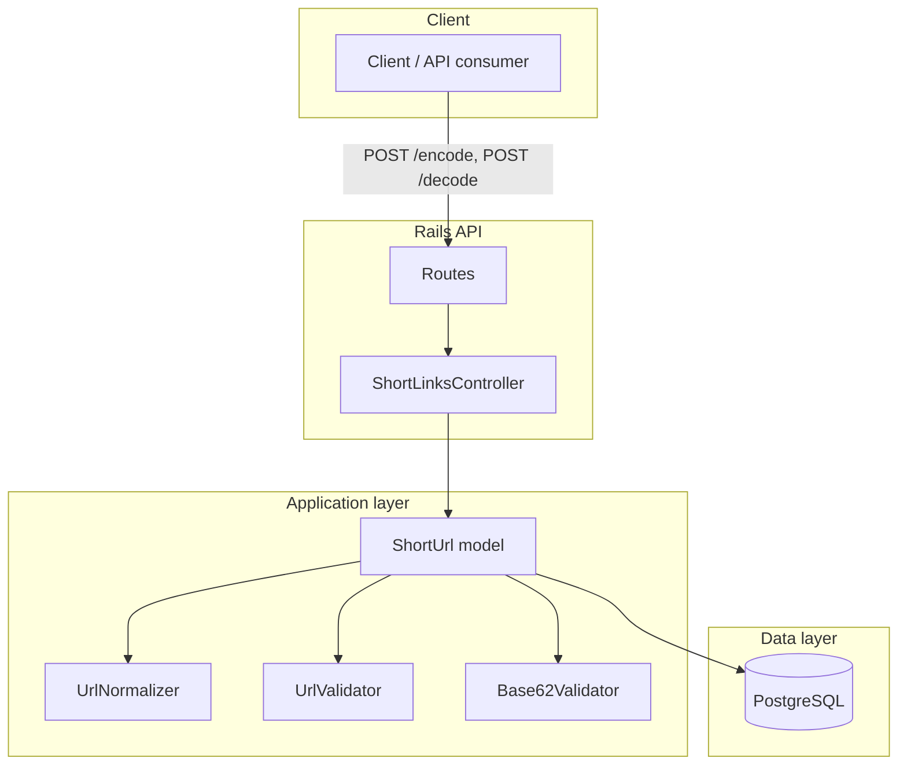
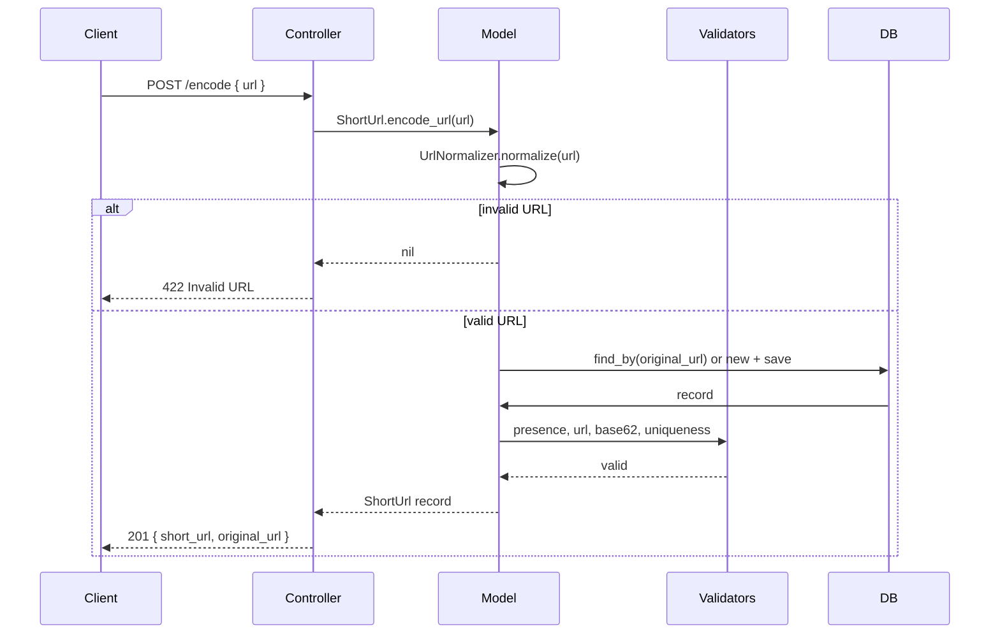
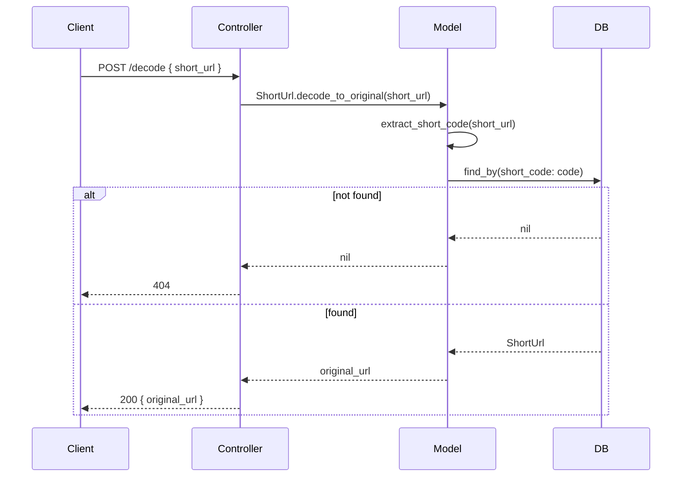
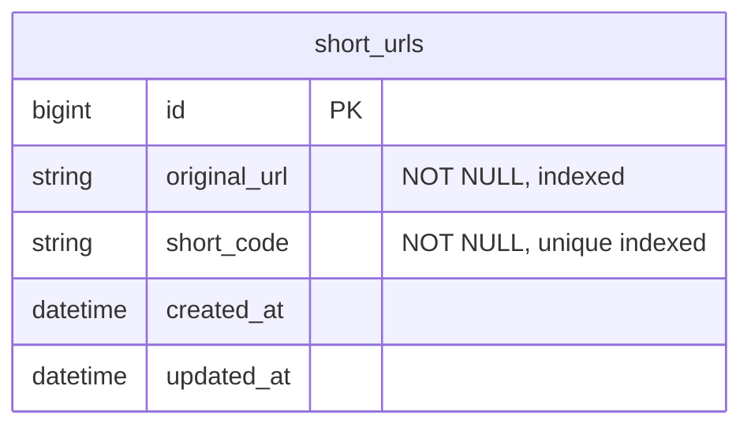

# ShortLink Engine — Architecture

## High-level overview



## Request flow

### Encode (URL → short URL)



### Decode (short URL → original URL)



## Component map

| Layer        | Component            | Responsibility                                      |
|-------------|----------------------|-----------------------------------------------------|
| **HTTP**    | Routes               | POST /encode, POST /decode → ShortLinksController   |
| **Controller** | ShortLinksController | Params, call model, JSON response, error handling    |
| **Model**   | ShortUrl             | encode_url, decode_to_original, normalize_url, DB   |
| **Validators** | UrlValidator      | original_url must be valid (HTTP/HTTPS, no js/data)  |
| **Validators** | Base62Validator   | short_code: base62 only, length 6                  |
| **Lib**     | UrlNormalizer       | Normalize and validate URL format                   |
| **Data**    | PostgreSQL           | short_urls (original_url, short_code)               |

## Data model



## File layout

```
shortlink-engine/
├── app/
│   ├── controllers/
│   │   ├── application_controller.rb
│   │   └── short_links_controller.rb   # encode, decode
│   ├── models/
│   │   └── short_url.rb
│   └── validators/
│       ├── url_validator.rb
│       └── base62_validator.rb
├── config/
│   ├── routes.rb                      # /encode, /decode
│   └── database.yml                   # PostgreSQL
├── lib/
│   └── url_normalizer.rb
├── db/
│   └── migrate/
│       └── 001_create_short_urls.rb
└── docs/
    └── ARCHITECTURE.md                 # this file
```
